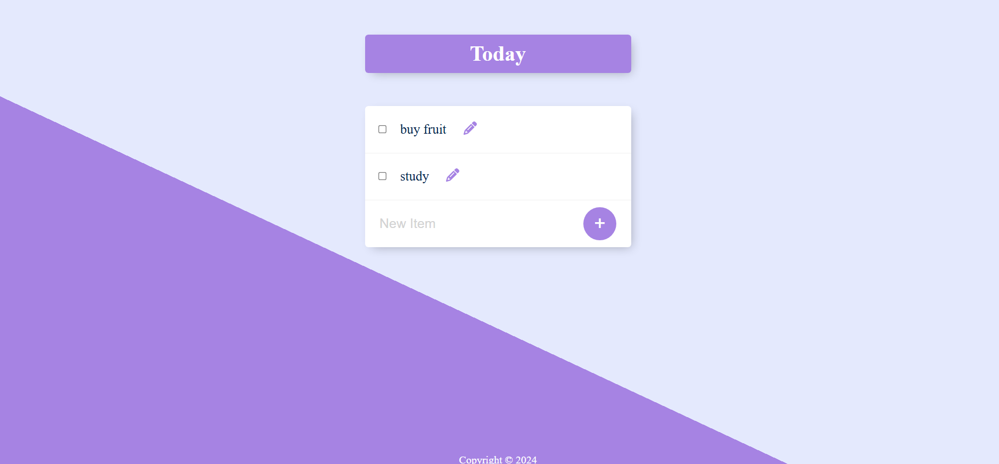

# ToDo List Manager 📝

A simple **To-Do List Manager** application built with `Node.js`, `Express`, and `PostgreSQL`. This app allows users to manage their tasks with functionalities such as **Add**, **Edit**, and **Delete**. All tasks are stored in a PostgreSQL database for persistent storage. 🚀

---

## Features ✨

- **Add Tasks:** Add new tasks to your to-do list.
- **Edit Tasks:** Update task details with ease.
- **Delete Tasks:** Remove completed or unwanted tasks.
- **Persistent Storage:** All tasks are stored in a PostgreSQL database.
- **Clean UI:** Ready to integrate with an `EJS` front-end for a dynamic user interface.

---

## Tech Stack 🛠️

- **Backend Framework:** [Express.js]
- **Database:** [PostgreSQL]
- **Middleware:** `body-parser` for handling form data.
- **View Engine:** [EJS] for rendering the front-end templates.

---

## Prerequisites ✅

1. [Node.js](https://nodejs.org/) (v14 or above)
2. [PostgreSQL](https://www.postgresql.org/) installed and running
3. A `todolist` table in the PostgreSQL database with the following schema:
   ```sql
   CREATE TABLE todolist (
       id SERIAL PRIMARY KEY,
       title VARCHAR(255) NOT NULL
   );
   ```

---

## Installation & Setup 🚀

1. Clone the repository:


2. Install dependencies:
   ```bash
   npm install
   ```

3. Configure the PostgreSQL connection:
   - Update the `pg.Client` configuration in the `index.js` file:
     ```javascript
     const db = new pg.Client({
         user: "your_postgres_user",
         host: "localhost",
         database: "world",
         password: "your_password",
         port: 5432,
     });
     ```

4. Start the server:
   ```bash
   node index.js
   ```
   The server will run on [http://localhost:3000](http://localhost:3000).

---

## API Endpoints 🌐

### `GET /`
- Fetches and renders the to-do list.

### `POST /add`
- Adds a new task to the to-do list.
- **Body Parameters:**
  - `newItem`: The title of the task to be added.

### `POST /edit`
- Edits an existing task.
- **Body Parameters:**
  - `updatedItemTitle`: The updated title of the task.
  - `updatedItemId`: The ID of the task to be updated.

### `POST /delete`
- Deletes a task from the to-do list.
- **Body Parameters:**
  - `deleteItemId`: The ID of the task to be deleted.

---

## Future Enhancements 🚀

- Add user authentication to support multiple users.
- Implement drag-and-drop sorting for tasks.
- Build a responsive front-end using React or Vue.js.
- Add categories and tags for tasks.

---


### Screenshots 🎨


---
